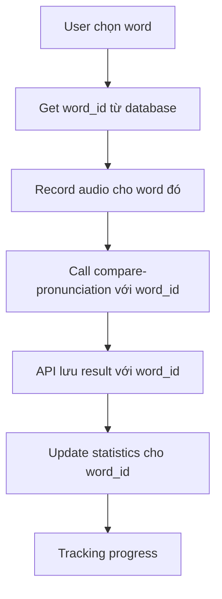

# Word ID Usage in Pronunciation System

## 🎯 Tại sao cần `word_id`?

`word_id` là **primary key** của từ vựng trong database, được sử dụng để:

### 1. **📚 Liên kết với Word Database**

```sql
-- word_id link đến bảng words
SELECT id, word, pronunciation, meaning, definition, example_sentence, audio_url, image_url
FROM words
WHERE id = {word_id}
```

**Mục đích**: Lấy thông tin chi tiết của từ (nghĩa, phát âm, ví dụ, audio, hình ảnh)

### 2. **💾 Lưu Speaking Results**

```javascript
// Trong saveSpeakingResult()
const resultData = {
  sessionId: session_id,
  userId: userId,
  wordId: word_id, // 🔑 Key để link result với word
  spokenText: spoken_text,
  overallScore: overall_score,
  // ...
};
```

**Mục đích**: Biết user đã practice từ nào với điểm số bao nhiêu

### 3. **📊 Tracking Word Mastery**

```javascript
// Trong updateSpeakingWordMastered()
if (score >= 70) {
  await pool.query(
    `
    INSERT INTO user_words_learned (user_id, word_id, learned_at)
    VALUES ($1, $2, NOW())
  `,
    [userId, wordId]
  );
}
```

**Mục đích**:

- Track từ nào user đã "mastered" (phát âm tốt)
- Tránh duplicate counting
- Tính statistics chính xác

### 4. **🎮 Quiz Integration**

```javascript
// Quiz questions link đến words
SELECT qq.*, w.word, w.meaning, w.pronunciation
FROM quiz_questions qq
JOIN words w ON qq.word_id = w.id
```

**Mục đích**: Consistency giữa quiz và speaking cho cùng 1 từ

### 5. **🔖 Bookmarking Words**

```javascript
// User có thể bookmark từ vựng
await quizModel.bookmarkWord(userId, word_id, notes);
```

**Mục đích**: User lưu từ khó, xem lại sau

### 6. **📈 Progress Analytics**

```sql
-- Thống kê từ đã học
SELECT COUNT(DISTINCT word_id) as words_mastered
FROM user_words_learned
WHERE user_id = {userId}
```

**Mục đích**: Dashboard hiển thị progress học từ vựng

## 🔄 Flow hoàn chỉnh với `word_id`:

### **Pronunciation Comparison API Flow:**



### **Concrete Example:**

1. **User chọn word "hello"**:

   ```javascript
   // Frontend get word info
   const word = { id: 123, word: "hello", pronunciation: "/həˈloʊ/" };
   ```

2. **User record audio nói "hello"**

3. **Call API với word_id**:

   ```javascript
   formData.append("word_id", 123); // 🔑 Specific word
   formData.append("reference_text", "hello"); // Text to compare
   formData.append("audio", audioFile); // User's audio
   ```

4. **Backend processes**:

   ```javascript
   // Lưu speaking result
   const result = await speakingModel.saveSpeakingResult({
     wordId: 123, // 🔑 Link result với word "hello"
     overallScore: 85,
     // ...
   });

   // Update word mastery
   if (score >= 70) {
     await UserModel.updateSpeakingWordMastered(userId, 123, 85);
     // → Thêm word "hello" vào danh sách words mastered
   }
   ```

5. **Statistics update**:
   ```sql
   -- User stats được update
   words_mastered = words_mastered + 1  -- Nếu là từ mới
   ```

## 🎯 Tại sao không dùng `reference_text`?

**❌ Vấn đề nếu chỉ dùng text:**

- Text có thể duplicate ("hello" vs "Hello")
- Không link được với word database
- Không track được progress chính xác
- Không biết word metadata (nghĩa, phát âm chuẩn)

**✅ Ưu điểm của `word_id`:**

- Unique identifier
- Link trực tiếp với word database
- Consistency across features
- Accurate progress tracking

## 📊 Database Schema:

```sql
-- words table (master data)
words: id(PK), word, pronunciation, meaning, definition, example_sentence, audio_url

-- speaking_results (pronunciation results)
speaking_results: id(PK), word_id(FK), user_id, overall_score, spoken_text

-- user_words_learned (progress tracking)
user_words_learned: user_id, word_id, learned_at (unique constraint)

-- quiz_questions (quiz integration)
quiz_questions: id(PK), word_id(FK), question_text, correct_answer
```

## 💡 Real-world Usage:

**Dashboard có thể hiển thị:**

- "Bạn đã học 45/100 từ trong level Beginner"
- "Từ 'pronunciation' cần practice thêm (score: 65%)"
- "Words mastered today: 'hello', 'world', 'good'"
- "Speaking accuracy for word 'beautiful': 85%"

**Tất cả dựa trên `word_id` tracking!** 🎯
